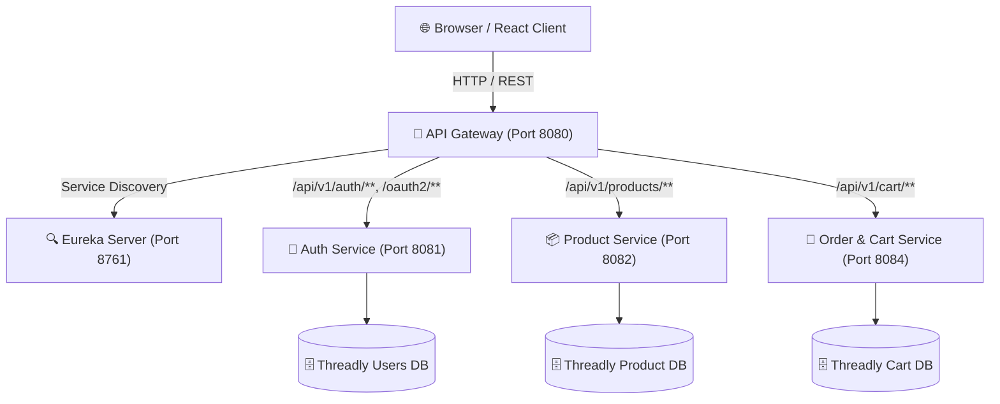

# Threadly — Microservices E-Commerce Platform

Threadly is a modern, full-stack, microservices-based e-commerce platform built with **Spring Boot 3**, **Spring Cloud**, **PostgreSQL**, and a **Vite + React + TypeScript** frontend. 

The architecture leverages Spring Cloud Gateway for unified API routing, Netflix Eureka for dynamic service discovery, JWT/OAuth2 for secure authentication, and PostgreSQL databases isolated per microservice bounded context.

---

## 🏗️ Architecture Overview



### Microservices & Components
- **`threadly-api-gateway`** (Port 8080): Spring Cloud Gateway serving as the single entry point, managing CORS, rate limits, and security routing.
- **`threadly-service-discovery`** (Port 8761): Netflix Eureka Discovery Server for microservice registration and load balancing.
- **`threadly-user-authentication`** (Port 8081): Manages signup with Gmail OTP verification, login, JWT token issuance, and Google OAuth2 integration.
- **`threadly-product-service`** (Port 8082): Manages product catalog, search, category filtering, and inventory attributes.
- **`threadly-order-and-cart-management`** (Port 8084): Manages user cart items, item quantity updates, and checkout logic.
- **`Frontend`**: React SPA built with Vite, TypeScript, Tailwind CSS, Lucide Icons, and Axios interceptors.

---

## ✨ Key Features

- 🔑 **Secure Authentication**: Traditional Email + Password login, OTP email verification, and Google OAuth2 Single Sign-On.
- 🎨 **Modern E-Commerce UI**: Responsive catalog with real-time search, category filtering, and 10-item pagination.
- 🛒 **Cart Synchronization**: Full cart management for logged-in users with localStorage fallback for guest users.
- 🐳 **Dockerized Setup**: Multi-container orchestration using `docker-compose`.

---

## 🛠️ Prerequisites

Make sure you have the following installed on your machine:
- [Git](https://git-scm.com/)
- [Docker Desktop](https://www.docker.com/products/docker-desktop/) (includes Docker Compose)
- [Node.js](https://nodejs.org/) (v18 or higher) and `npm`

---

## 🚀 Step-by-Step Local Setup Guide

Follow these instructions to set up and run the entire platform on a new local machine.

### Step 1: Clone the Repository
```bash
git clone https://github.com/utkarshjain45/Threadly.git
cd Threadly
```

---

### Step 2: Configure Backend Environment Variables
Navigate to the `Backend` directory and set up the `.env` file from the provided template:

```bash
cd Backend
cp .env.example .env
```

Open `Backend/.env` in your text editor and fill in your actual credentials:
```env
# Database Credentials
POSTGRES_USER=postgres
POSTGRES_PASSWORD=postgres

# Secret Keys
JWT_SECRET_KEY=bZ1C/BhnIVRROhmEch4+xyoc1wc/aI9z1J1+gxRp5qACifGl3iVz3DczLoCZz382pFsjzlXwnLvMzKaf8sPjyA==

# SMTP Email Configuration (for OTP Verification)
MAIL_HOST=smtp.gmail.com
MAIL_PORT=587
MAIL_USERNAME=your-email@gmail.com
MAIL_PASSWORD=your-gmail-app-password

# Google OAuth2 Credentials (Optional for Google Login)
GOOGLE_CLIENT_ID=your-google-client-id.apps.googleusercontent.com
GOOGLE_CLIENT_SECRET=your-google-client-secret
GOOGLE_REDIRECT_URI=http://localhost:8080/login/oauth2/code/{registrationId}

# CORS Configuration
CORS_ALLOWED_ORIGINS=http://localhost:5173,http://localhost:5174,http://localhost:3000
```

> 💡 **Note**: For `MAIL_PASSWORD`, generate a Gmail **App Password** via *Google Account Security ➔ 2-Step Verification ➔ App Passwords*.

---

### Step 3: Configure Frontend Environment Variables
Navigate to the `Frontend` directory and set up its `.env` file:

```bash
cd ../Frontend
cp .env.example .env
```

Verify that `Frontend/.env` contains the backend Gateway URL:
```env
VITE_API_BASE_URL=http://localhost:8080
```

---

### Step 4: Launch Backend Services with Docker Compose
From the `Backend` directory, build and run all microservices and databases:

```bash
cd ../Backend
docker-compose up -d --build
```

This command automatically pulls necessary base images, builds all Spring Boot JARs, and starts 8 containers:
1. `threadly-service-discovery`
2. `threadly-api-gateway`
3. `threadly-user-authentication`
4. `threadly-product-service`
5. `threadly-order-and-cart-management`
6. `threadly-users-db`
7. `threadly-product-db`
8. `threadly-order-and-cart-db`

You can verify container statuses with:
```bash
docker-compose ps
```

---

### Step 5: Start the Frontend Application
Navigate to `Frontend/`, install dependencies, and run the development server:

```bash
cd ../Frontend
npm install
npm run dev
```

The frontend will start at **`http://localhost:5173`**.

---

## 🔍 Verification & Dashboards

| Service / Dashboard | URL | Purpose |
| :--- | :--- | :--- |
| **Frontend Application** | `http://localhost:5173` | Main Web UI |
| **API Gateway** | `http://localhost:8080` | Entry Point for REST APIs |
| **Eureka Discovery Server** | `http://localhost:8761` | Service Registration Dashboard |
| **Product Service Direct** | `http://localhost:8082` | Microservice Internal Port |
| **Auth Service Direct** | `http://localhost:8081` | Microservice Internal Port |
| **Order & Cart Direct** | `http://localhost:8084` | Microservice Internal Port |

---

## 🔒 Security Best Practices
- All `.env` files are ignored via `.gitignore` to prevent secret leakage.
- JWT tokens are stored in local storage and attached via Axios request interceptors.
- Cross-Origin Resource Sharing (CORS) is centrally managed by Spring Cloud Gateway.

---

## 📝 License & Author
Crafted with ❤️ by **[Utkarsh Jain](https://github.com/utkarshjain45)**.
